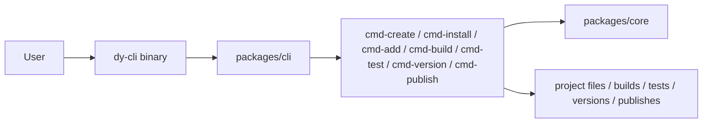

# dy-cli

## Architecture



`dy-cli` is a command-first toolkit for package projects. The intent is simple: users work through `dy-cli`, not through package-manager-specific scripts.

It supports:

- `monorepo`
- `single`

The public command surface is:

- `create`
- `install`
- `add`
- `build`
- `test`
- `version`
- `publish`

For the Chinese guide, see `README_ZH.md`.

## Install

Install `@dysonic/dy-cli` globally once, then keep using the `dy-cli` binary directly.

## Quick Start

Create a project:

```bash
dy-cli create --project monorepo --dest-dir ./demo
dy-cli create --project single --dest-dir ./demo
```

Install dependencies:

```bash
cd ./demo
dy-cli install
```

Add a child package in a monorepo:

```bash
dy-cli add button
```

Run the common flows:

```bash
dy-cli build
dy-cli build --types
dy-cli build --umd

dy-cli test
dy-cli test --coverage

dy-cli version
dy-cli version --beta
dy-cli version --beta-exit
dy-cli version --set 0.0.1

dy-cli publish
dy-cli publish --dry-run
dy-cli publish --tag beta
```

Default scope rules:

- in a `single` project, `build / test / version / publish` target the current package
- at a monorepo root, `build / test / publish` target all child packages by default
- inside a monorepo child package, `build / test / publish` target only that package
- at a fixed-version monorepo root, `version` updates the whole release set

## Commands

### `create`

Create a new project scaffold.

```bash
dy-cli create --project monorepo --dest-dir ./demo
dy-cli create --project single --dest-dir ./demo
```

Options:

- `--project <project>`: `monorepo` or `single`
- `--dest-dir <destDir>`: target directory relative to `cwd`
- `--project-name <projectName>`: override the inferred project name
- `--force`: overwrite a non-empty target directory

Generated projects include `dy.config.ts` as the main metadata entry, plus the default `dy-cli` flow for install, build, test, version, and publish.

### `install`

Install project dependencies through the managed adapter.

```bash
dy-cli install
```

The command resolves the project root first, then chooses the underlying package manager automatically.

### `add`

Create a child package inside a monorepo workspace.

```bash
dy-cli add button
dy-cli add --package-name card --description "Card component"
```

Options:

- `[packageName]`: positional package name
- `--package-name <packageName>`: explicit package name
- `--dest-dir <destDir>`: package container directory, default is `packages`
- `--description <description>`: package description
- `--private`: generate a private package
- `--side-effects`: mark the package as having side effects

`add` works only in projects whose `dy.config.ts` declares `project.type: 'monorepo'`.
Generated child packages do not add extra `build / test / publish` scripts. Those flows stay behind the global `dy-cli` entry.

### `build`

Build a project package without delegating to project-local build scripts.

```bash
dy-cli build
dy-cli build --types
dy-cli build --umd
```

Options:

- `--mode <mode>`: build mode
- `--types`: build declaration files
- `--umd`: build UMD output
- `--name <name>`: UMD global name
- `--externals <externals>`: comma-separated UMD externals
- `--globals <globals>`: comma-separated UMD globals, such as `react:React,react-dom:ReactDOM`

Run it at a monorepo root to build all child packages by default.
If a package declares `bin` in `package.json`, the default `dy-cli build` also emits the executable output.

### `test`

Run Jest tests for a project package.

```bash
dy-cli test
dy-cli test --coverage
dy-cli test --watch
dy-cli test --update-snapshot
```

Options:

- `--config <config>`: explicit Jest config path
- `--coverage`: collect coverage
- `--watch`: watch mode
- `--update-snapshot`: update snapshots

Run it at a monorepo root to test all child packages by default.

### `version`

Manage release versions through `dy-cli`.

```bash
dy-cli version
dy-cli version --beta
dy-cli version --beta-exit
dy-cli version --set 0.0.1
```

Options:

- `--set <version>`: required for `single` projects
- `--beta`: enter beta pre mode before versioning a fixed monorepo
- `--beta-exit`: exit beta pre mode before versioning a fixed monorepo

### `publish`

Publish a project package or a fixed monorepo release set.

```bash
dy-cli publish
dy-cli publish --dry-run
dy-cli publish --tag beta
```

Options:

- `--dry-run`: run publish without uploading
- `--tag <tag>`: dist-tag
- `--access <access>`: `public` or `restricted`
- `--otp <otp>`: registry one-time password
- `--registry <registry>`: registry URL

At a monorepo root, `publish` builds, tests, and releases all child packages by default. `publish` refuses to publish `private: true` packages.

## `dy.config.ts`

`dy-cli` reads project metadata and command defaults from `dy.config.ts`.

Example:

```ts
export default {
  project: {
    type: 'monorepo',
    packageDir: 'packages',
    versionStrategy: 'fixed',
  },
  commands: {
    create: {
      defaultTemplateType: 'monorepo',
      templates: {
        monorepo: {
          label: 'Monorepo',
          description: 'Create a workspace-based project scaffold.',
        },
        single: {
          label: 'Single repo',
          description: 'Create a single-package project scaffold.',
        },
      },
    },
    add: {
      destDir: 'packages',
    },
    build: {
      mode: 'production',
      umd: {
        name: 'DemoLibrary',
        externals: ['react', 'react-dom'],
        globals: {
          react: 'React',
          'react-dom': 'ReactDOM',
        },
      },
    },
    test: {
      config: './jest.config.js',
    },
    version: {
      betaTag: 'beta',
    },
    publish: {
      access: 'public',
      betaTag: 'beta',
      workspaceConcurrency: 8,
    },
  },
};
```

## Package Layout

The workspace is split into focused packages:

- `packages/core`: shared interfaces, config contracts, helpers, and base abstractions
- `packages/cli`: the public `dy-cli` entrypoint
- `packages/cmd-create`: project scaffolding
- `packages/cmd-install`: dependency installation
- `packages/cmd-add`: monorepo child package scaffolding
- `packages/cmd-build`: package build pipeline
- `packages/cmd-test`: package test runner
- `packages/cmd-version`: version management
- `packages/cmd-publish`: package publish runner

## Development

This repository also uses `dy-cli` as the main workflow entry:

```bash
dy-cli install
dy-cli test
dy-cli build
```
