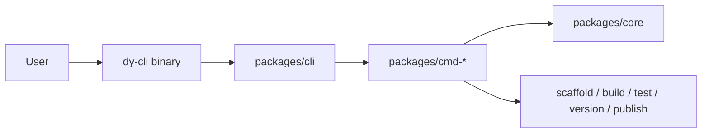

# dy-cli

`dy-cli` is a command-first toolkit for TypeScript package projects.

It provides one stable CLI surface for creating projects, installing dependencies, building
packages, running tests, managing versions, and publishing releases. The goal is to keep project
workflows explicit and repeatable without spreading build, test, and release behavior across hidden
package-manager scripts.

English | [简体中文](./README_ZH.md)

## Features

- Scaffold `single` and `monorepo` package projects.
- Use `dy.config.ts` as the project metadata and command-default entry.
- Build ESM, CJS, UMD, declaration files, and executable bin outputs.
- Run Jest through project-aware command scopes.
- Manage fixed-version monorepo releases without user-facing Changesets files.
- Publish single packages or monorepo release sets with dry-run, tag, access, OTP, and registry
  options.
- Resolve package-manager and workspace context from explicit project metadata instead of relying
  on global CLI state.

## Quick Start

Install the public CLI when you need to create or manage projects directly:

```bash
npm install -g @dysonic/dy-cli
```

Create a project:

```bash
dy-cli create --project monorepo --dest-dir ./demo
dy-cli create --project single --dest-dir ./demo
```

Enter the generated project and install dependencies:

```bash
cd ./demo
dy-cli install
```

Run common workflows:

```bash
dy-cli build
dy-cli test
dy-cli version --patch
dy-cli publish --dry-run
```

Generated projects also include a local `dy-cli` dependency and `packageManager` metadata, so
project scripts and workspace recursion do not depend on a globally installed binary.

## Project Types

`dy-cli` currently supports two project shapes.

| Type       | Use when                                         | Default behavior                                                                 |
| ---------- | ------------------------------------------------ | -------------------------------------------------------------------------------- |
| `single`   | You publish one package from the project root.   | Build, test, version, and publish target the root package.                       |
| `monorepo` | You publish multiple packages from `packages/*`. | Root-level build, test, version, and publish can orchestrate all child packages. |

Both templates include baseline TypeScript, Jest, build, version, publish, formatting, linting, and
release-preparation configuration. Monorepo templates intentionally do not expose `pnpm-workspace.yaml`
or user-facing `.changeset` files; `dy.config.ts` is the source of project workflow metadata.

## Core Concepts

### `dy.config.ts`

`dy-cli` reads project metadata and command defaults from `dy.config.ts`.

```ts
import type { ExternalRunCommandsConfig } from 'dy-cli';

export default {
  project: {
    type: 'monorepo',
    packageDir: 'packages',
    versionStrategy: 'fixed',
  },
  commands: {
    add: {
      destDir: 'packages',
    },
    build: {
      mode: 'production',
      umd: {
        name: 'DemoLibrary',
        externals: ['react', 'react-dom'],
        globals: {
          react: 'React',
          'react-dom': 'ReactDOM',
        },
      },
    },
    test: {
      config: './jest.config.js',
    },
    version: {
      betaTag: 'beta',
    },
    publish: {
      access: 'public',
      betaTag: 'beta',
      workspaceConcurrency: 8,
    },
  },
} satisfies ExternalRunCommandsConfig;
```

### Scope Resolution

Command scope is determined from the nearest `dy.config.ts` and package location.

| Location                 | Scope                                        |
| ------------------------ | -------------------------------------------- |
| `single` root            | Current package                              |
| `monorepo` root          | All child packages for workspace-aware flows |
| `monorepo` child package | Current child package                        |

### Package Manager Resolution

`dy-cli` resolves package manager intent from `packageManager` or lockfile metadata and walks up to
the workspace root when a command starts inside a child package. Internal recursive `dy-cli` calls
run through `pnpm exec dy-cli ...` or `npm exec -- dy-cli ...` instead of relying on PATH injection.

## Commands

### `create`

Create a new project scaffold.

```bash
dy-cli create --project monorepo --dest-dir ./demo
dy-cli create --project single --dest-dir ./demo
```

Options:

| Option                         | Description                             |
| ------------------------------ | --------------------------------------- |
| `--project <project>`          | `monorepo` or `single`.                 |
| `--dest-dir <destDir>`         | Target directory relative to `cwd`.     |
| `--project-name <projectName>` | Override the inferred project name.     |
| `--force`                      | Overwrite a non-empty target directory. |

### `install`

Install project dependencies through the resolved package manager.

```bash
dy-cli install
```

### `add`

Create a child package in a monorepo project.

```bash
dy-cli add button
dy-cli add --package-name card --description "Card component"
```

Options:

| Option                         | Description                                            |
| ------------------------------ | ------------------------------------------------------ |
| `[packageName]`                | Positional package name.                               |
| `--package-name <packageName>` | Explicit package name.                                 |
| `--dest-dir <destDir>`         | Package container directory, defaulting to `packages`. |
| `--description <description>`  | Package description.                                   |
| `--private`                    | Generate a private package.                            |
| `--side-effects`               | Mark the package as having side effects.               |

`add` only applies to projects whose `dy.config.ts` declares `project.type: 'monorepo'`.

### `build`

Build project packages without delegating to project-local build scripts.

```bash
dy-cli build
dy-cli build --types
dy-cli build --umd
dy-cli build --bin
```

Options:

| Option                    | Description                                             |
| ------------------------- | ------------------------------------------------------- |
| `--mode <mode>`           | Build mode.                                             |
| `--workspace`             | Run build for all workspace packages.                   |
| `--types`                 | Build declaration files.                                |
| `--umd`                   | Build UMD output.                                       |
| `--bin`                   | Build executable bin output.                            |
| `--name <name>`           | UMD global name.                                        |
| `--externals <externals>` | Comma-separated UMD externals.                          |
| `--globals <globals>`     | Comma-separated UMD globals, for example `react:React`. |

### `test`

Run Jest for the resolved project scope.

```bash
dy-cli test
dy-cli test --coverage
dy-cli test --watch
dy-cli test --update-snapshot
```

Options:

| Option              | Description                           |
| ------------------- | ------------------------------------- |
| `--config <config>` | Explicit Jest config path.            |
| `--workspace`       | Run tests for all workspace packages. |
| `--coverage`        | Collect coverage.                     |
| `--watch`           | Run tests in watch mode.              |
| `--update-snapshot` | Update Jest snapshots.                |

### `version`

Manage package versions.

```bash
dy-cli version --set 0.0.1
dy-cli version --patch
dy-cli version --minor --beta
dy-cli version --beta-exit
```

Rules:

- `single` projects require `--set <version>`.
- Fixed-version monorepos require one of `--patch`, `--minor`, or `--major`.
- `--beta` enters prerelease mode before versioning a fixed monorepo.
- `--beta-exit` exits prerelease mode for fixed monorepo versioning.

### `publish`

Publish a package or a fixed monorepo release set.

```bash
dy-cli publish
dy-cli publish --dry-run
dy-cli publish --tag beta
dy-cli publish --workspace --beta
```

Options:

| Option                  | Description                                                                  |
| ----------------------- | ---------------------------------------------------------------------------- |
| `--workspace`           | Run workspace build, test, and publish orchestration from the monorepo root. |
| `--beta`                | Use the configured beta tag for prerelease workspace releases.               |
| `--dry-run`             | Run publish without uploading packages.                                      |
| `--tag <tag>`           | Release dist-tag.                                                            |
| `--access <access>`     | `public` or `restricted`.                                                    |
| `--otp <otp>`           | Registry one-time password.                                                  |
| `--registry <registry>` | Registry URL.                                                                |

`publish` rejects `private: true` packages. In prerelease mode, workspace publish requires each
target package to already have a stable registry release; this avoids first-time prerelease packages
taking over the `latest` dist-tag.

Avoid exposing `dy-cli publish` through npm publish lifecycle names such as `prepublishOnly`,
`publish`, or `postpublish`. Use `release` instead.

## Package Layout

| Package                | Responsibility                                                             |
| ---------------------- | -------------------------------------------------------------------------- |
| `packages/cli`         | Public `dy-cli` executable and command assembly.                           |
| `packages/core`        | Shared contracts, config loading, project resolution, helpers, and errors. |
| `packages/cmd-create`  | Project scaffolding.                                                       |
| `packages/cmd-install` | Dependency installation.                                                   |
| `packages/cmd-add`     | Monorepo child package scaffolding.                                        |
| `packages/cmd-build`   | Package build pipeline.                                                    |
| `packages/cmd-test`    | Jest runner integration.                                                   |
| `packages/cmd-version` | Version management.                                                        |
| `packages/cmd-publish` | Publish orchestration.                                                     |

Each package also has its own README for package-level responsibilities and boundaries.

## Architecture



The dependency direction is intentionally simple:

- `packages/cli` assembles command packages.
- `packages/cmd-*` implement command behavior.
- `packages/core` provides shared contracts and runtime helpers.
- `packages/core` must not depend on command packages.

## Development

Use Node `>=18.20.8`.

```bash
pnpm install
pnpm lint
pnpm prettier
pnpm test
```

Focused tests can be run through the same CLI path:

```bash
pnpm test -- --runInBand packages/cmd-create/test/index.test.ts
```

Build and release validation:

```bash
pnpm exec dy-cli build
pnpm exec dy-cli publish --dry-run
```

When changing release, publish, version, build, or scaffold behavior, prefer focused regression
coverage in the affected package before broad runs.

## Release Notes

This repository uses a fixed-version monorepo strategy managed by `dy-cli` itself.

- Do not reintroduce user-facing `.changeset` files or `@changesets/*`.
- Use `dy-cli version --patch|--minor|--major` for monorepo releases.
- Use `dy-cli publish` or `dy-cli publish --dry-run` for workspace publishing.
- Keep published package versions aligned across `packages/*`.

## Contributing

Keep changes aligned with the package boundaries above. Command packages should own orchestration and
side effects for their command; shared behavior should live in `packages/core` only when it is truly
cross-command infrastructure.

Pull requests should include:

- user-visible behavior summary
- affected packages or workflows
- verification commands
- release impact when touching build, versioning, publish, scaffolding, or CLI behavior

## License

[MIT](./LICENSE)
