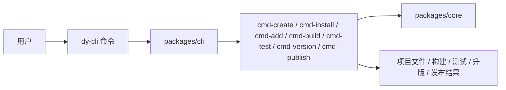

# dy-cli

## 架构图



`dy-cli` 是一套命令优先的包项目工具。核心目标是让用户围绕 `dy-cli` 建立统一心智，而不是直接面向包管理器命令或项目内脚本。

它支持两类项目：

- `monorepo`
- `single`

当前对外命令集合是：

- `create`
- `install`
- `add`
- `build`
- `test`
- `version`
- `publish`

## 安装

先全局安装一次 `@dysonic/dy-cli`，之后项目内统一直接使用 `dy-cli`。

## 快速开始

创建项目：

```bash
dy-cli create --project monorepo --dest-dir ./demo
dy-cli create --project single --dest-dir ./demo
```

安装依赖：

```bash
cd ./demo
dy-cli install
```

在 monorepo 中创建子包：

```bash
dy-cli add button
```

执行常用流程：

```bash
dy-cli build
dy-cli build --types
dy-cli build --umd

dy-cli test
dy-cli test --coverage

dy-cli version
dy-cli version --beta
dy-cli version --beta-exit
dy-cli version --set 0.0.1

dy-cli publish
dy-cli publish --dry-run
dy-cli publish --tag beta
```

默认作用域规则：

- `single` 项目下，`build / test / version / publish` 默认作用当前包
- monorepo 根目录下，`build / test / publish` 默认作用所有子包
- monorepo 子包目录下，`build / test / publish` 默认只作用当前子包
- fixed 模式 monorepo 根目录下，`version` 默认控制整仓版本

## 命令说明

### `create`

用于初始化项目骨架。

```bash
dy-cli create --project monorepo --dest-dir ./demo
dy-cli create --project single --dest-dir ./demo
```

参数：

- `--project <project>`：项目类型，当前支持 `monorepo` 和 `single`
- `--dest-dir <destDir>`：目标目录，相对于 `cwd`
- `--project-name <projectName>`：显式指定项目名
- `--force`：目标目录非空时强制覆盖

说明：

- `create` 会生成 `dy.config.ts`，并把它作为项目主元数据入口
- 模板会把后续 `install / add / build / test / version / publish` 的默认命令流一并铺好

### `install`

用于安装项目依赖。

```bash
dy-cli install
```

说明：

- `install` 会先解析项目根目录
- 底层实际使用的包管理器由 `dy-cli` 自动识别，用户不需要直接面向它

### `add`

用于在 monorepo 项目里快速创建子包。

示例：

```bash
dy-cli add button
dy-cli add --package-name card --description "Card component"
```

参数：

- `[packageName]`：位置参数形式的包名
- `--package-name <packageName>`：显式指定包名
- `--dest-dir <destDir>`：子包目录，默认是 `packages`
- `--description <description>`：包描述
- `--private`：将子包标记为私有包
- `--side-effects`：将子包标记为有副作用

说明：

- `add` 只适用于 `dy.config.ts` 中声明为 `project.type: 'monorepo'` 的项目
- 新建出的子包默认不会额外生成 `build / test / publish` 这类 package script
- 子包的构建、测试、升版、发布统一通过全局 `dy-cli` 入口完成

### `build`

用于构建项目包，不再依赖项目内部自定义 build 脚本。

示例：

```bash
dy-cli build
dy-cli build --types
dy-cli build --umd
```

参数：

- `--mode <mode>`：构建模式
- `--types`：只构建类型产物
- `--umd`：只构建 UMD 产物
- `--name <name>`：UMD 全局变量名
- `--externals <externals>`：UMD external 包名，逗号分隔
- `--globals <globals>`：UMD external 对应的全局变量映射，逗号分隔

说明：

- `dy-cli build` 默认构建当前包的 ESM / CJS 产物
- `dy-cli build --types` 构建 `d.ts`
- `dy-cli build --umd` 构建 UMD 包
- 如果包在 `package.json` 中声明了 `bin`，默认 `dy-cli build` 也会同时产出可执行文件
- 在 monorepo 根目录执行时，默认会构建所有子包
- 在 monorepo 子包目录里执行时，会自动向上查找最近的 `dy.config.ts`

### `test`

用于运行项目包的 Jest 单测。

示例：

```bash
dy-cli test
dy-cli test --coverage
dy-cli test --watch
dy-cli test --update-snapshot
```

参数：

- `--config <config>`：显式指定 Jest 配置文件
- `--coverage`：输出覆盖率
- `--watch`：watch 模式
- `--update-snapshot`：更新 snapshot

说明：

- `test` 当前基于 Jest
- 在 monorepo 根目录执行时，默认会测试所有子包
- 在 monorepo 子包目录里执行时，会自动向上查找最近的 `dy.config.ts` 和 Jest 配置

### `version`

用于通过 `dy-cli` 管理版本号。

示例：

```bash
dy-cli version
dy-cli version --beta
dy-cli version --beta-exit
dy-cli version --set 0.0.1
```

参数：

- `--set <version>`：`single` 项目必填
- `--beta`：fixed monorepo 升版前进入 beta 预发布模式
- `--beta-exit`：fixed monorepo 升版前退出 beta 预发布模式

### `publish`

用于发布项目包，或者在 monorepo 根目录发布整组子包。

示例：

```bash
dy-cli publish
dy-cli publish --dry-run
dy-cli publish --tag beta
```

参数：

- `--dry-run`：仅演练，不真正上传
- `--tag <tag>`：dist-tag
- `--access <access>`：发布权限，支持 `public` / `restricted`
- `--otp <otp>`：二次校验口令
- `--registry <registry>`：registry 地址

说明：

- 在 monorepo 根目录执行时，`publish` 默认会先构建、测试，再发布所有子包
- 在子包目录执行时，`publish` 只发布当前包
- `private: true` 的包会被直接拒绝发布
- 当工作区处于 Changesets 的 prerelease 模式时，目标包必须已经在 registry 上存在至少一个稳定版本；否则会直接拒绝发布，避免首次 beta 包意外占用 `latest` 标签

## `dy.config.ts`

`dy-cli` 通过 `dy.config.ts` 读取项目元信息和命令默认配置。

示例：

```ts
export default {
  project: {
    type: 'monorepo',
    packageDir: 'packages',
    versionStrategy: 'fixed',
  },
  commands: {
    create: {
      defaultTemplateType: 'monorepo',
      templates: {
        monorepo: {
          label: 'Monorepo',
          description: 'Create a workspace-based project scaffold.',
        },
        single: {
          label: 'Single repo',
          description: 'Create a single-package project scaffold.',
        },
      },
    },
    add: {
      destDir: 'packages',
    },
    build: {
      mode: 'production',
      umd: {
        name: 'DemoLibrary',
        externals: ['react', 'react-dom'],
        globals: {
          react: 'React',
          'react-dom': 'ReactDOM',
        },
      },
    },
    test: {
      config: './jest.config.js',
    },
    version: {
      betaTag: 'beta',
    },
    publish: {
      access: 'public',
      betaTag: 'beta',
      workspaceConcurrency: 8,
    },
  },
};
```

当前配置结构说明：

- `project`：项目类型、包目录、版本策略等主元信息
- `commands.create`：项目初始化默认模板和模板描述
- `commands.add`：monorepo 子包创建配置
- `commands.build`：构建模式和 UMD 配置
- `commands.test`：Jest 配置和测试开关默认值
- `commands.version`：版本管理默认项
- `commands.publish`：发布默认参数

## 工作区结构

当前仓库按职责拆成这些包：

- `packages/core`
  提供核心接口、配置契约、公共 helper、基础抽象
- `packages/cli`
  对外统一暴露 `dy-cli` 命令行入口
- `packages/cmd-create`
  负责项目初始化
- `packages/cmd-install`
  负责依赖安装
- `packages/cmd-add`
  负责 monorepo 子包创建
- `packages/cmd-build`
  负责包构建能力
- `packages/cmd-test`
  负责包测试能力
- `packages/cmd-version`
  负责版本管理
- `packages/cmd-publish`
  负责包发布能力

## 开发

这个仓库本身也使用 `dy-cli` 作为主工作流入口：

```bash
dy-cli install
dy-cli test
dy-cli build
```
