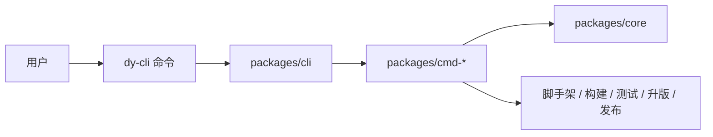

# dy-cli

`dy-cli` 是一套面向 TypeScript 包项目的命令优先工具集。

它把项目创建、依赖安装、构建、测试、版本管理和发布收敛到一个稳定的 CLI 面上。核心目标是让项目工作流显式、可重复，而不是把构建、测试、发布逻辑分散在隐性的包管理器脚本里。

[English](./README.md) | 简体中文

## 特性

- 支持初始化 `single` 和 `monorepo` 两类包项目。
- 使用 `dy.config.ts` 作为项目元信息和命令默认配置入口。
- 支持 ESM、CJS、UMD、类型声明和可执行 bin 产物构建。
- 基于项目作用域运行 Jest。
- 支持 fixed-version monorepo 发布，不暴露用户侧 `.changeset` 文件。
- 支持单包发布和 monorepo 发布编排，包含 dry-run、tag、access、OTP、registry 等选项。
- 从显式项目元数据解析包管理器和 workspace 上下文，不依赖全局 CLI 状态。

## 快速开始

需要直接创建或管理项目时，先安装公开 CLI：

```bash
npm install -g @dysonic/dy-cli
```

创建项目：

```bash
dy-cli create --project monorepo --dest-dir ./demo
dy-cli create --project single --dest-dir ./demo
```

进入生成项目并安装依赖：

```bash
cd ./demo
dy-cli install
```

执行常用流程：

```bash
dy-cli build
dy-cli test
dy-cli version --patch
dy-cli publish --dry-run
```

生成项目会默认包含本地 `dy-cli` 依赖和 `packageManager` 元数据，因此项目脚本和 workspace 递归执行不会依赖全局安装的二进制。

## 项目类型

`dy-cli` 当前支持两类项目结构。

| 类型       | 适用场景                     | 默认行为                                           |
| ---------- | ---------------------------- | -------------------------------------------------- |
| `single`   | 从项目根目录发布一个包。     | 构建、测试、升版、发布默认作用于根包。             |
| `monorepo` | 从 `packages/*` 发布多个包。 | 根目录下的构建、测试、升版、发布可以编排所有子包。 |

两类模板都会默认包含 TypeScript、Jest、构建、版本、发布、格式化、lint 和 release 准备配置。monorepo 模板不会暴露 `pnpm-workspace.yaml` 或用户侧 `.changeset` 文件；`dy.config.ts` 是项目工作流元数据的来源。

## 核心概念

### `dy.config.ts`

`dy-cli` 通过 `dy.config.ts` 读取项目元信息和命令默认配置。

```ts
import type { ExternalRunCommandsConfig } from '@dysonic/dy-cli';

export default {
  project: {
    type: 'monorepo',
    packageDir: 'packages',
    versionStrategy: 'fixed',
  },
  commands: {
    add: {
      destDir: 'packages',
    },
    build: {
      mode: 'production',
      umd: {
        name: 'DemoLibrary',
        externals: ['react', 'react-dom'],
        globals: {
          react: 'React',
          'react-dom': 'ReactDOM',
        },
      },
    },
    test: {
      config: './jest.config.js',
    },
    version: {
      betaTag: 'beta',
    },
    publish: {
      access: 'public',
      betaTag: 'beta',
      workspaceConcurrency: 8,
    },
  },
} satisfies ExternalRunCommandsConfig;
```

### 作用域解析

命令作用域由最近的 `dy.config.ts` 和当前包位置决定。

| 执行位置            | 作用域                               |
| ------------------- | ------------------------------------ |
| `single` 根目录     | 当前包                               |
| `monorepo` 根目录   | workspace 感知流程默认作用于所有子包 |
| `monorepo` 子包目录 | 当前子包                             |

### 包管理器解析

`dy-cli` 会从 `packageManager` 或 lockfile 元数据解析包管理器，并在子包目录执行时向上查找 workspace 根。内部递归调用 `dy-cli` 时会通过 `pnpm exec dy-cli ...` 或 `npm exec -- dy-cli ...` 执行，而不是依赖 PATH 注入。

## 命令

### `create`

创建项目骨架。

```bash
dy-cli create --project monorepo --dest-dir ./demo
dy-cli create --project single --dest-dir ./demo
```

选项：

| 选项                           | 说明                         |
| ------------------------------ | ---------------------------- |
| `--project <project>`          | `monorepo` 或 `single`。     |
| `--dest-dir <destDir>`         | 目标目录，相对于 `cwd`。     |
| `--project-name <projectName>` | 覆盖根据目录推断出的项目名。 |
| `--force`                      | 覆盖非空目标目录。           |

### `install`

通过解析出的包管理器安装项目依赖。

```bash
dy-cli install
```

### `add`

在 monorepo 项目中创建子包。

```bash
dy-cli add button
dy-cli add --package-name card --description "Card component"
```

选项：

| 选项                           | 说明                              |
| ------------------------------ | --------------------------------- |
| `[packageName]`                | 位置参数形式的包名。              |
| `--package-name <packageName>` | 显式包名。                        |
| `--dest-dir <destDir>`         | 子包容器目录，默认是 `packages`。 |
| `--description <description>`  | 包描述。                          |
| `--private`                    | 生成私有包。                      |
| `--side-effects`               | 标记包存在副作用。                |

`add` 只适用于 `dy.config.ts` 声明了 `project.type: 'monorepo'` 的项目。

### `build`

构建项目包，不委托给项目内自定义 build 脚本。

```bash
dy-cli build
dy-cli build --types
dy-cli build --umd
dy-cli build --bin
```

选项：

| 选项                      | 说明                                            |
| ------------------------- | ----------------------------------------------- |
| `--mode <mode>`           | 构建模式。                                      |
| `--workspace`             | 构建所有 workspace 子包。                       |
| `--types`                 | 构建类型声明文件。                              |
| `--umd`                   | 构建 UMD 产物。                                 |
| `--bin`                   | 构建可执行 bin 产物。                           |
| `--name <name>`           | UMD 全局变量名。                                |
| `--externals <externals>` | UMD external 包名，逗号分隔。                   |
| `--globals <globals>`     | UMD global 映射，逗号分隔，例如 `react:React`。 |

### `test`

在解析出的项目作用域内运行 Jest。

```bash
dy-cli test
dy-cli test --coverage
dy-cli test --watch
dy-cli test --update-snapshot
```

选项：

| 选项                | 说明                      |
| ------------------- | ------------------------- |
| `--config <config>` | 显式指定 Jest 配置路径。  |
| `--workspace`       | 测试所有 workspace 子包。 |
| `--coverage`        | 收集覆盖率。              |
| `--watch`           | watch 模式。              |
| `--update-snapshot` | 更新 Jest 快照。          |

### `version`

管理包版本。

```bash
dy-cli version --set 0.0.1
dy-cli version --patch
dy-cli version --minor --beta
dy-cli version --beta-exit
```

规则：

- `single` 项目必须使用 `--set <version>`。
- fixed-version monorepo 必须使用 `--patch`、`--minor` 或 `--major` 之一。
- `--beta` 会在 fixed monorepo 升版前进入预发布模式。
- `--beta-exit` 用于 fixed monorepo 退出预发布模式。

### `publish`

发布单个包或 fixed monorepo 发布集合。

```bash
dy-cli publish
dy-cli publish --dry-run
dy-cli publish --tag beta
dy-cli publish --workspace --beta
```

选项：

| 选项                    | 说明                                                    |
| ----------------------- | ------------------------------------------------------- |
| `--workspace`           | 从 monorepo 根目录执行 workspace 构建、测试、发布编排。 |
| `--beta`                | 使用配置的 beta tag 发布预发布 workspace 版本。         |
| `--dry-run`             | 仅演练，不上传包。                                      |
| `--tag <tag>`           | 发布 dist-tag。                                         |
| `--access <access>`     | `public` 或 `restricted`。                              |
| `--otp <otp>`           | registry 一次性验证码。                                 |
| `--registry <registry>` | registry 地址。                                         |

`publish` 会拒绝发布 `private: true` 的包。预发布模式下，workspace 发布要求每个目标包在 registry 上已经存在稳定版本，避免首次 beta 包占用 `latest` dist-tag。

执行 `npm publish` 前，`publish` 会校验 `main`、`module`、`types`、`browser`、`bin` 等声明的入口文件是否真实存在。workspace 发布会先为声明了类型或 UMD 入口的包构建对应产物，再做最终包文件校验。

不要通过 `prepublishOnly`、`publish`、`postpublish` 这类 npm 发布生命周期脚本名暴露 `dy-cli publish`，建议使用 `release`。

## 包结构

| 包                     | 职责                                              |
| ---------------------- | ------------------------------------------------- |
| `packages/cli`         | 对外 `dy-cli` 可执行入口和命令装配。              |
| `packages/core`        | 公共契约、配置加载、项目解析、helper 和错误类型。 |
| `packages/cmd-create`  | 项目脚手架。                                      |
| `packages/cmd-install` | 依赖安装。                                        |
| `packages/cmd-add`     | monorepo 子包脚手架。                             |
| `packages/cmd-build`   | 包构建流水线。                                    |
| `packages/cmd-test`    | Jest 运行集成。                                   |
| `packages/cmd-version` | 版本管理。                                        |
| `packages/cmd-publish` | 发布编排。                                        |

每个包都包含自己的 README，用于说明包级职责和边界。

## 架构



依赖方向保持简单：

- `packages/cli` 负责装配命令包。
- `packages/cmd-*` 实现具体命令行为。
- `packages/core` 提供公共契约和运行时 helper。
- `packages/core` 不能依赖命令包。

## 开发

使用 Node `>=18.20.8`。

```bash
pnpm install
pnpm lint
pnpm prettier
pnpm test
```

聚焦测试可以走相同 CLI 路径：

```bash
pnpm test -- --runInBand packages/cmd-create/test/index.test.ts
```

构建和发布验证：

```bash
pnpm exec dy-cli build
pnpm exec dy-cli publish --dry-run
```

修改 release、publish、version、build 或 scaffold 行为时，优先在受影响包补聚焦回归，再跑更宽的验证。

## 发布说明

当前仓库使用由 `dy-cli` 自身管理的 fixed-version monorepo 策略。

- 不要重新引入用户侧 `.changeset` 文件或 `@changesets/*`。
- monorepo 发版使用 `dy-cli version --patch|--minor|--major`。
- workspace 发布使用 `dy-cli publish` 或 `dy-cli publish --dry-run`。
- 保持 `packages/*` 下已发布包版本一致。

## 贡献

变更应遵守上面的包边界。命令包负责自己的编排和副作用；只有真正跨命令复用的基础能力才应进入 `packages/core`。

PR 应包含：

- 用户可感知变更摘要
- 受影响包或工作流
- 已执行的验证命令
- 如果修改 build、version、publish、scaffold 或 CLI 行为，需要说明发布影响

## License

[MIT](./LICENSE)
