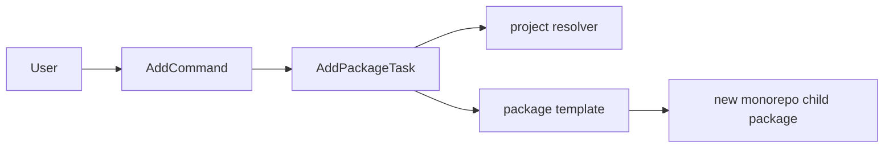

# @dysonic/dy-cli-cmd-add

## Architecture



`@dysonic/dy-cli-cmd-add` implements the `dy-cli add` command.

Its job is to create child packages inside a monorepo quickly.

For the Chinese version, see `README_ZH.md`.

## Role

This package only serves the monorepo scenario.
It is not used for `single` projects.

It has already absorbed the project-local script behavior, including:

- child package directory creation
- template rendering
- prompt-based metadata completion
- formatting as a finishing step

## Main Contents

- `src/commands/add.ts`
  command entry for `add`
- `src/tasks/add-package-task.ts`
  child package creation task
- `src/templates/package`
  child package template

## Command Semantics

```bash
dy-cli add button
dy-cli add --package-name card --description "Card component"
```

Generated child packages stay minimal by default:

- they do not add extra `build`, `test`, or `publish` package scripts
- child-package build, test, version, and publish flows are driven from the global `dy-cli` entry

The command resolves monorepo context from `dy.config.ts` project metadata instead of relying on package-manager-specific workspace files.

## Design Notes

The goal of this package is to make monorepo child package creation go through `dy-cli add` instead of relying on extra project-local scripts or per-package command wrappers.
