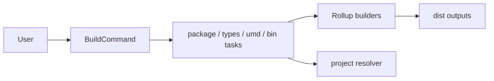

# @dysonic/dy-cli-cmd-build

## Architecture



`@dysonic/dy-cli-cmd-build` implements the `dy-cli build` command.

It builds project packages and supports:

- default package build
- declaration output build
- UMD output build

For the Chinese version, see `README_ZH.md`.

## Role

This package is no longer a `package.json` script wrapper.
It owns the real build behavior.

That means:

- `dy-cli build` performs the build directly
- it does not depend on extra project-local build scripts

## Main Contents

- `src/commands/build.ts`
  build command entry
- `src/tasks`
  target-specific build tasks
- `src/builders`
  concrete build implementations

## Command Semantics

```bash
dy-cli build
dy-cli build --types
dy-cli build --umd
```

## Supported Capabilities

- builds ESM / CJS by default
- also emits the executable output by default when the package declares `bin`
- builds declaration files with `--types`
- builds UMD bundles with `--umd`
- reads UMD settings from `dy.config.ts`
- builds all child packages by default when executed at a monorepo root
- searches upward for the nearest `dy.config.ts` in monorepo child package scenarios

## Design Notes

This package follows a `Command -> Task -> Builder` layering:

- `Command` parses args and config
- `Task` orchestrates build targets
- `Builder` handles concrete Rollup behavior
