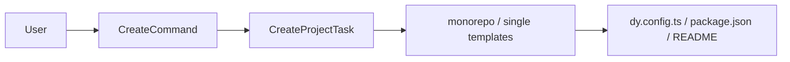

# @dysonic/dy-cli-cmd-create

## Architecture



`@dysonic/dy-cli-cmd-create` implements the `dy-cli create` command.

It initializes project scaffolds for two project types:

- `monorepo`
- `single`

For the Chinese version, see `README_ZH.md`.

## Role

This package is responsible only for project creation.
It does not execute follow-up flows itself, but it does lay down the default `dy-cli` workflow for install, add, build, test, version, and publish.

Generated projects include:

- `dy.config.ts`
- project-type-specific templates
- default entrypoints for later `dy-cli` flows

## Main Contents

- `src/commands/create.ts`
  command entry for `create`
- `src/tasks/create-project-task.ts`
  template rendering and file output
- `src/templates/monorepo`
  monorepo project templates
- `src/templates/single`
  single-package templates

## Command Semantics

Typical usage:

```bash
dy-cli create --project monorepo --dest-dir ./
dy-cli create --project single --dest-dir ./
```

## Design Notes

This package uses filesystem templates instead of hard-coded file output inside the task.

In practice:

- templates live in `src/templates/*`
- the command chooses the template
- the task renders it into the target directory
