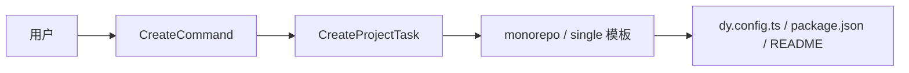

# @dysonic/dy-cli-cmd-create

## 架构图



`@dysonic/dy-cli-cmd-create` 是 `dy-cli create` 命令的实现包。

它负责初始化项目骨架，当前支持两类项目：

- `monorepo`
- `single`

## 包定位

这个包只负责“创建项目”，不直接执行后续流程，但会把 `install / add / build / test / version / publish` 的默认命令流铺好。

创建出来的项目会内置：

- `dy.config.ts`
- 对应项目类型的模板文件
- 后续 `dy-cli` 工作流所需的默认入口

## 主要内容

- `src/commands/create.ts`
  `create` 命令入口
- `src/tasks/create-project-task.ts`
  模板渲染和文件输出逻辑
- `src/templates/monorepo`
  monorepo 项目模板
- `src/templates/single`
  single 项目模板

## 当前命令语义

典型用法：

```bash
dy-cli create --project monorepo --dest-dir ./
dy-cli create --project single --dest-dir ./
```

## 设计说明

这个包已经改成“文件系统模板驱动”，而不是在 task 中硬编码输出文件。

也就是说：

- 模板放在 `src/templates/*`
- 命令负责选择模板
- task 负责渲染模板到目标目录
