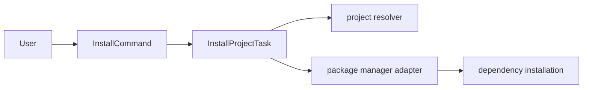

# @dysonic/dy-cli-cmd-install

## Architecture



`@dysonic/dy-cli-cmd-install` implements the `dy-cli install` command.

Its job is to install project dependencies through the unified `dy-cli` entry instead of asking users to choose a package-manager command directly.

## Role

This package is intentionally small:

- resolve project context from `dy.config.ts`
- jump to the project root
- delegate dependency installation to the package-manager adapter

## Command Semantics

```bash
dy-cli install
```

## Behavior

- in `single` projects, it installs at the current project root
- in monorepo child packages, it walks upward and installs from the monorepo root
- the underlying package manager is detected automatically
