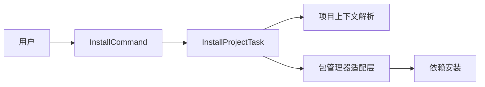

# @dysonic/dy-cli-cmd-install

## 架构图



`@dysonic/dy-cli-cmd-install` 是 `dy-cli install` 命令的实现包。

它的职责是把依赖安装统一收口到 `dy-cli` 入口，而不是让用户自己选择某个包管理器命令。

## 包定位

这个包保持很轻：

- 通过 `dy.config.ts` 解析项目上下文
- 自动切到项目根目录
- 把真正的安装动作交给包管理器适配层

## 命令语义

```bash
dy-cli install
```

## 行为说明

- 在 `single` 项目中，会从当前项目根目录安装依赖
- 在 monorepo 子包目录中，会自动向上回到 monorepo 根目录安装依赖
- 底层实际使用的包管理器由 `dy-cli` 自动识别
