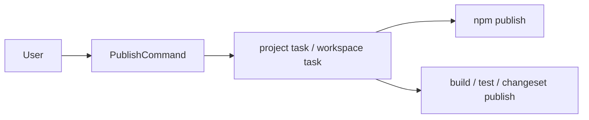

# @dysonic/dy-cli-cmd-publish

## Architecture



`@dysonic/dy-cli-cmd-publish` implements the `dy-cli publish` command.

It is responsible for publishing project packages.

For the Chinese version, see `README_ZH.md`.

## Role

This package handles both:

- package publishing for `single` projects and monorepo child packages
- default full-release publishing when executed at a fixed monorepo root

## Main Contents

- `src/commands/publish.ts`
  publish command entry
- `src/tasks/publish-project-task.ts`
  publish execution task

## Command Semantics

```bash
dy-cli publish
dy-cli publish --dry-run
dy-cli publish --tag beta
```

## Supported Capabilities

- `--dry-run`
- `--tag`
- `--access`
- `--otp`
- `--registry`

## Behavior Constraints

- running it at a monorepo root publishes the full child-package set by default
- in monorepo child packages, it searches upward for the nearest `dy.config.ts`
- packages with `private: true` are rejected
- when the workspace is in Changesets prerelease mode, every target package must already have a stable version published; otherwise the command aborts before publishing

## Design Notes

This package has been refactored from a publish-script wrapper into a real publish command implementation.
It stays behind the `dy-cli publish` entry instead of asking users to orchestrate registry publishing manually.
