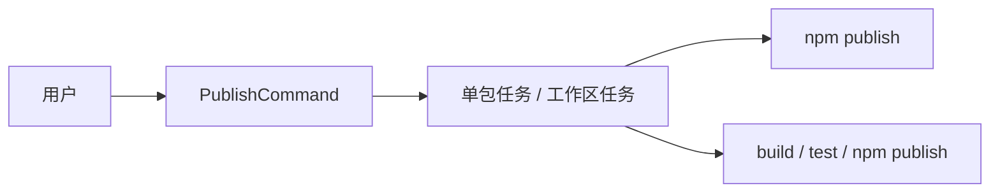

# @dysonic/dy-cli-cmd-publish

## 架构图



`@dysonic/dy-cli-cmd-publish` 是 `dy-cli publish` 命令的实现包。

它负责发布项目包。

## 包定位

这个包当前同时处理两类场景：

- `single` 项目或 monorepo 子包的当前包发布
- fixed monorepo 根目录下的整组子包发布

## 主要内容

- `src/commands/publish.ts`
  发布命令入口
- `src/tasks/publish-project-task.ts`
  发布执行任务

## 当前命令语义

```bash
dy-cli publish
dy-cli publish --dry-run
dy-cli publish --tag beta
```

## 支持能力

- `--dry-run`
- `--tag`
- `--access`
- `--otp`
- `--registry`

## 行为约束

- 在 monorepo 根目录执行时，默认发布整组子包
- 在 monorepo 子包里会向上查找最近的 `dy.config.ts`
- `private: true` 的包会被拒绝发布
- 当工作区处于 dy-cli prerelease 模式时，所有目标包都必须已经发布过稳定版本；否则命令会在真正发布前直接中止
- `dy-cli publish` 不允许从 `prepublishOnly`、`publish`、`postpublish` 这类 npm 发布生命周期脚本里再次进入；请改用 `release` 之类的脚本名

## 设计说明

这个包已经从“执行某个 publish 脚本”重构成了真正的发布命令实现，用户只需要面向 `dy-cli publish`。
