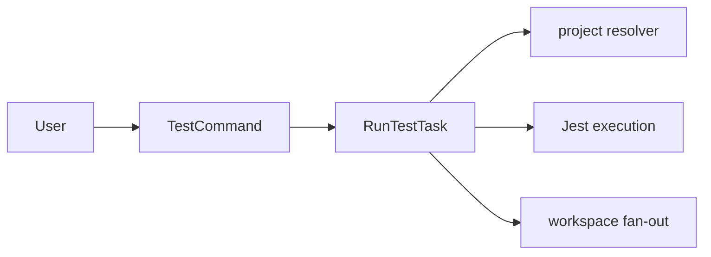

# @dysonic/dy-cli-cmd-test

## Architecture



`@dysonic/dy-cli-cmd-test` implements the `dy-cli test` command.

It runs Jest tests for project packages.

For the Chinese version, see `README_ZH.md`.

## Role

This package is currently focused on the Jest workflow and serves:

- monorepo child packages
- single-package npm libraries

It has already moved test execution behavior out of project-local scripts and into the command package itself.

## Main Contents

- `src/commands/test.ts`
  test command entry
- `src/tasks/run-test-task.ts`
  Jest execution task

## Command Semantics

```bash
dy-cli test
dy-cli test --coverage
dy-cli test --watch
dy-cli test --update-snapshot
```

## Supported Capabilities

- searches upward for the nearest `dy.config.ts`
- resolves the Jest config automatically
- runs tests for all child packages by default at a monorepo root
- runs tests for the current package in single projects or monorepo child packages
- supports coverage, watch mode, and snapshot update mode

## Design Notes

This package does not try to abstract multiple test frameworks yet.
It focuses on making the Jest path solid first.
