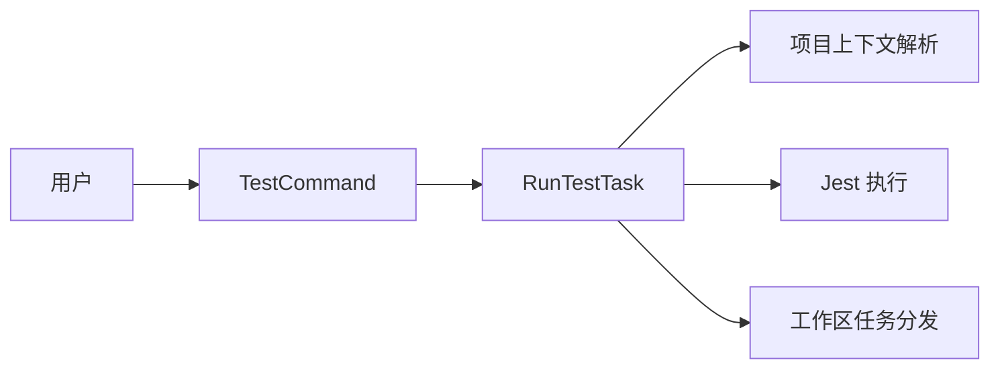

# @dysonic/dy-cli-cmd-test

## 架构图



`@dysonic/dy-cli-cmd-test` 是 `dy-cli test` 命令的实现包。

它负责运行项目包的 Jest 单测。

## 包定位

这个包当前聚焦 Jest 场景，服务于：

- monorepo 子包
- single 项目 npm 包

它已经把原本项目内部的测试脚本能力收回到命令实现中。

## 主要内容

- `src/commands/test.ts`
  测试命令入口
- `src/tasks/run-test-task.ts`
  Jest 运行任务

## 当前命令语义

```bash
dy-cli test
dy-cli test --coverage
dy-cli test --watch
dy-cli test --update-snapshot
```

## 支持能力

- 向上查找最近的 `dy.config.ts`
- 自动解析 Jest 配置文件
- 在 monorepo 根目录执行时默认运行所有子包测试
- 在 single 项目或 monorepo 子包目录执行时运行当前包测试
- 支持覆盖率、watch、snapshot 更新

## 设计说明

这个包当前不追求测试框架抽象，先把 Jest 这一条主路径做好。
