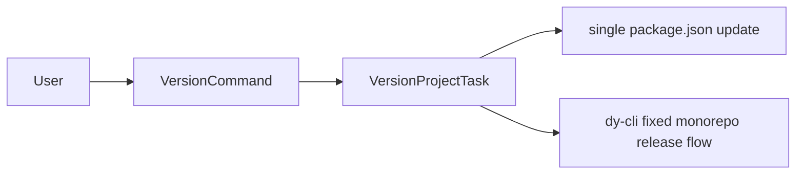

# @dysonic/dy-cli-cmd-version

## Architecture



`@dysonic/dy-cli-cmd-version` implements the `dy-cli version` command.

It separates version management from `publish` so users can think about release preparation and release execution as two different steps.

## Role

This package handles:

- fixed-version monorepo version orchestration
- single-package version updates

## Command Semantics

```bash
dy-cli version --patch
dy-cli version --minor --beta
dy-cli version --beta-exit
dy-cli version --set 0.0.1
```

## Behavior

- in a fixed monorepo root, `dy-cli version` requires one of `--patch`, `--minor`, or `--major`
- fixed monorepo versioning is handled entirely by `dy-cli`
- `--beta` and `--beta-exit` are only for fixed monorepo versioning
- in a `single` project, `--set <version>` updates the package version directly
