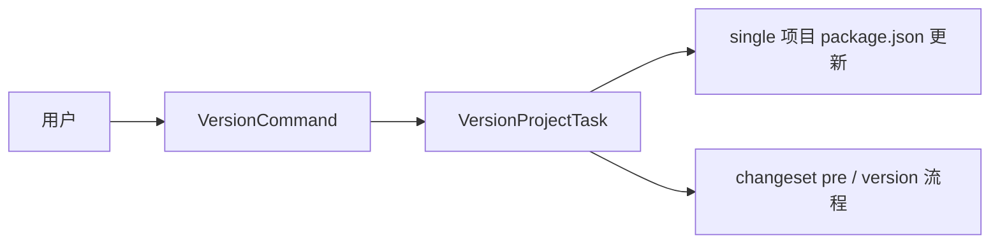

# @dysonic/dy-cli-cmd-version

## 架构图



`@dysonic/dy-cli-cmd-version` 是 `dy-cli version` 命令的实现包。

它把版本管理从 `publish` 中拆开，让用户把“准备版本”和“执行发布”视为两个独立步骤。

## 包定位

这个包负责：

- fixed monorepo 的统一升版编排
- single 项目的单包版本更新

## 命令语义

```bash
dy-cli version
dy-cli version --beta
dy-cli version --beta-exit
dy-cli version --set 0.0.1
```

## 行为说明

- 在 fixed monorepo 根目录下，`dy-cli version` 会对整组发布包执行统一升版
- `--beta` 和 `--beta-exit` 只适用于 fixed monorepo 升版流程
- 在 `single` 项目中，`--set <version>` 会直接更新当前包版本号
