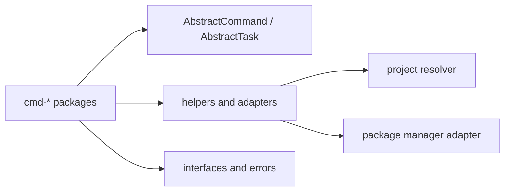

# @dysonic/dy-cli-core

## Architecture



`@dysonic/dy-cli-core` is the shared foundation package for `dy-cli`.

It provides:

- command abstractions
- external config contracts
- shared helpers
- error models
- base classes such as `AbstractCommand` and `AbstractTask`

For the Chinese version, see `README_ZH.md`.

## Role

This package does not implement concrete business commands.
It provides the shared infrastructure used by:

- `create`
- `add`
- `build`
- `test`
- `publish`

## Main Contents

- `src/commands`
  command base classes such as `AbstractCommand`
- `src/tasks`
  task base classes such as `AbstractTask`
- `src/interfaces`
  config contracts for `dy.config.ts` and command config types
- `src/helpers`
  config loading, path resolution, logging, and shared utilities
- `src/errors`
  `DyCliError` and unified error codes

## Public Surface

This package mainly exposes two kinds of capabilities:

1. runtime abstractions
   such as `AbstractCommand` and `AbstractTask`

2. config definition helpers
   such as `defineConfig(...)`

## Typical Usage

Projects use this package for `dy.config.ts` typing:

```ts
import { defineConfig } from '@dysonic/dy-cli-core';

export default defineConfig({
  commands: {},
});
```
